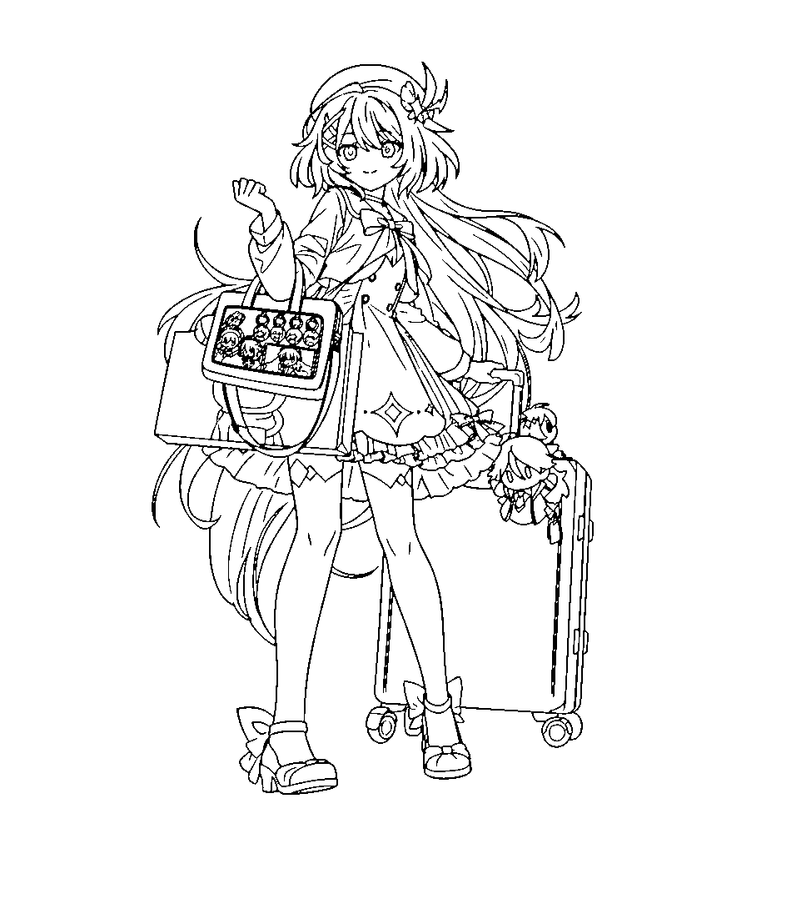
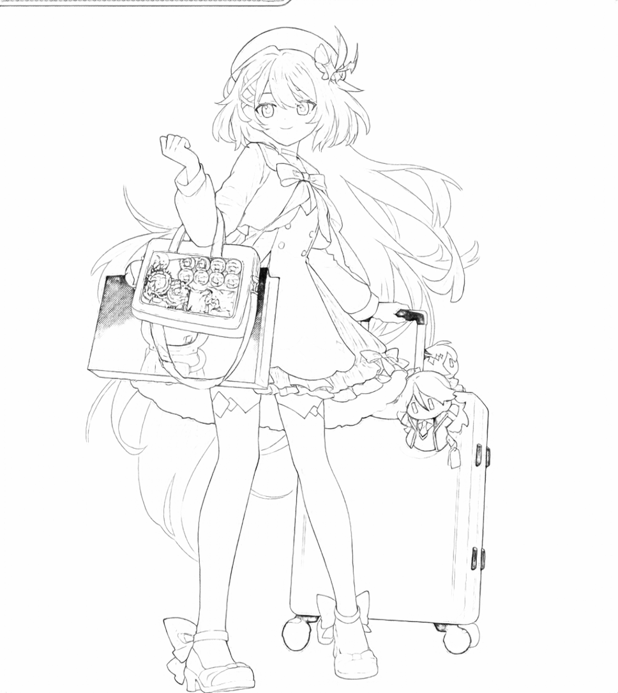
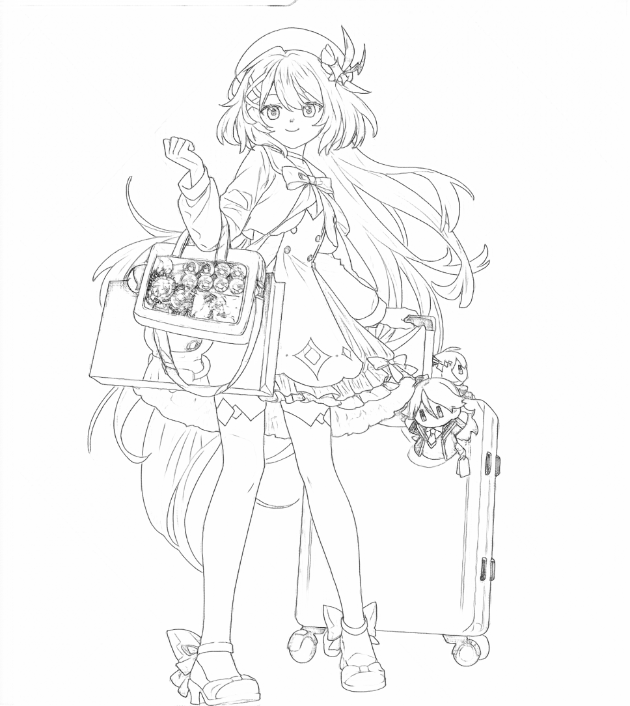
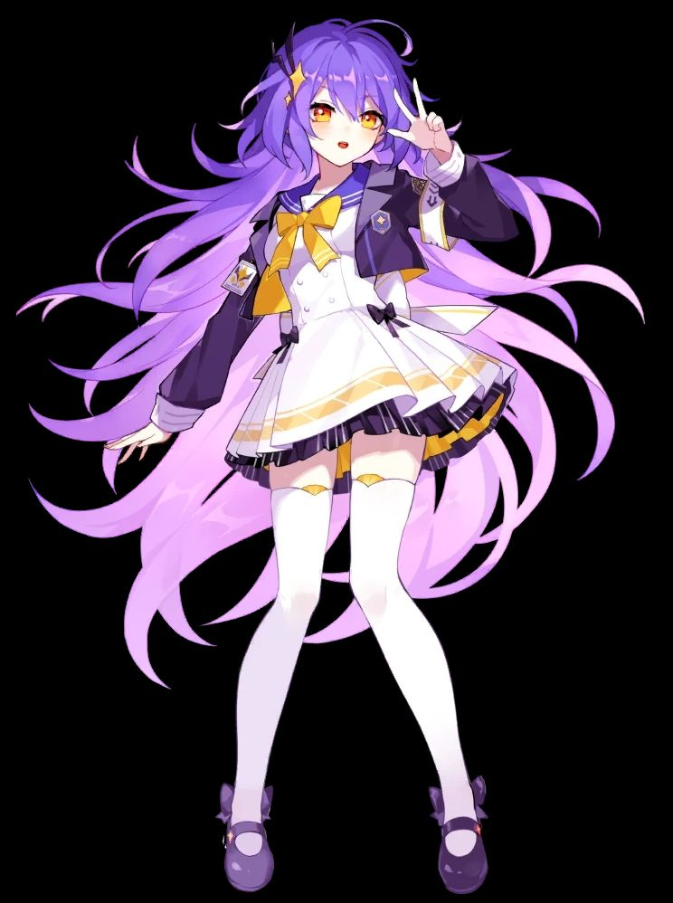
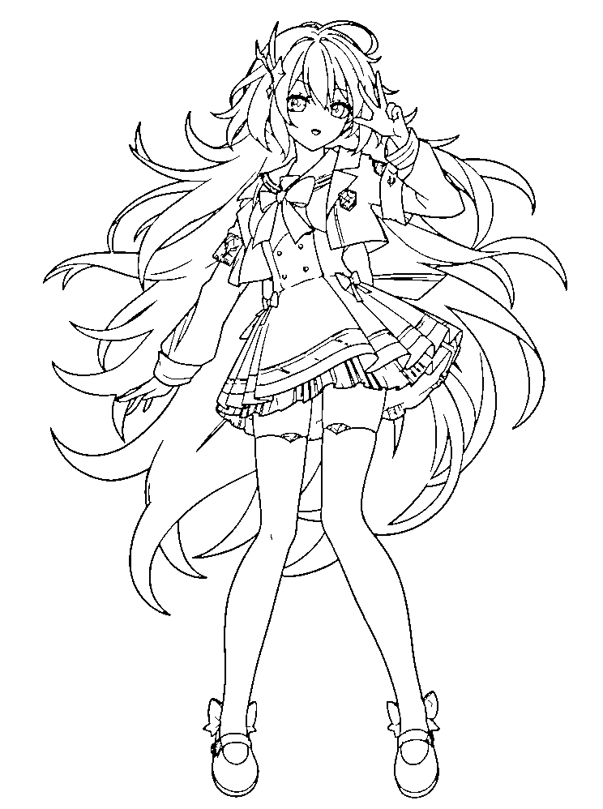
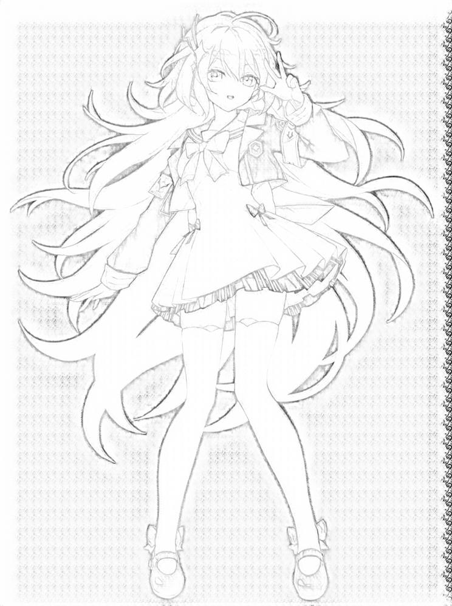
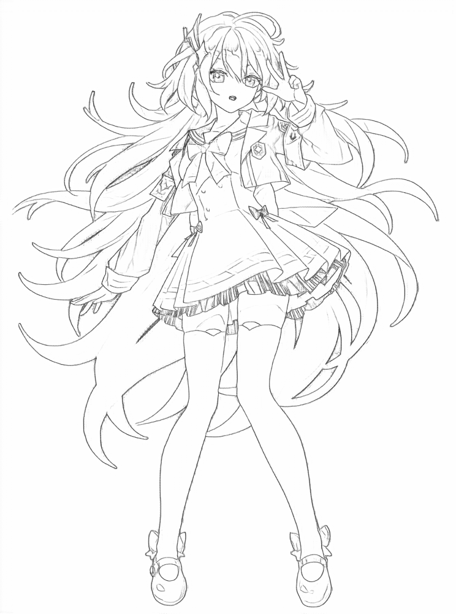
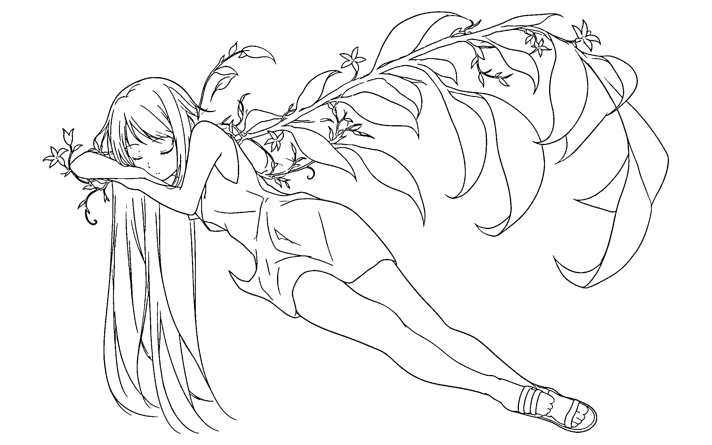
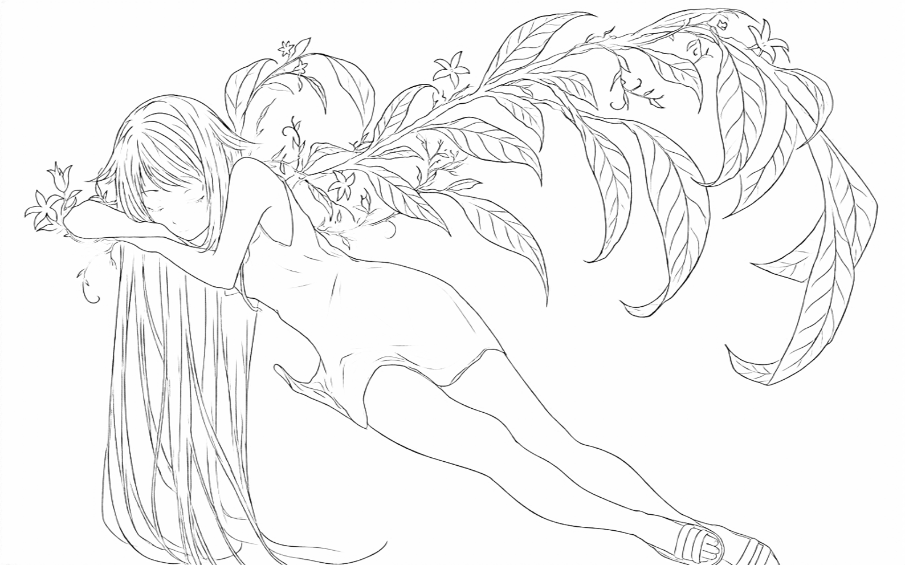
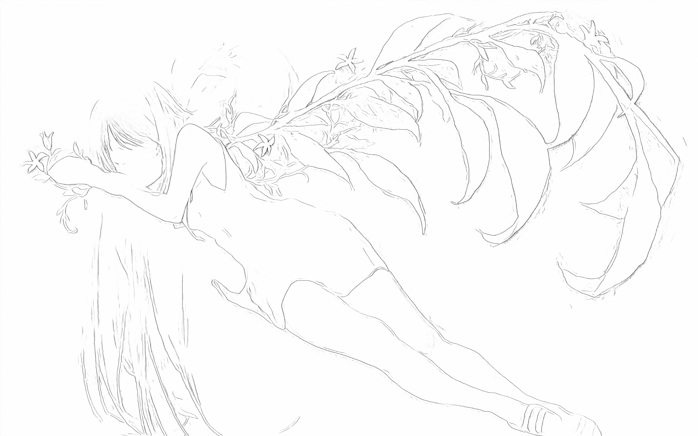

# LLM Fourier 线稿提取与旋臂预处理

这个项目是 `ProjectFourier` 的 API 线稿提取分支/前处理工具。它把输入图片发送给 LLM/图像 API 做语义线稿提取，然后在本地把返回的灰度线稿二值化，用 potrace 导出 SVG，按连通区域拆分组件，最后生成和 `ProjectFourier` 后续 Fourier 旋臂流程兼容的组件与预计算数据。

## 和 ProjectFourier 的关系

`ProjectFourier` 原本负责从图片生成线稿、拆组件、预计算 DFT，并用网页查看器播放 Fourier 旋臂动画。本项目保留了后半段的数据结构和查看器思路，把传统图像处理的线稿提取前段替换为 API 生成的 `api_line_raw.png`。

- 本项目负责：调用图像 API、保存 `api_line_raw.png`、本地生成 `API_Line.png`、导出 `API_Line.svg` 和 `comp\API_Line_*.svg`。
- 两边共享的核心格式：`<result-root>\<image>\comp\*.svg`、`<result-root>\<image>\dft_data\*.json`、`<result-root>\<image>\FourierCoefficient\*.txt`。
- 本项目默认输出到 `results_api`；`ProjectFourier` 默认读取 `results_v2`。目录名不同，但内部结构兼容。
- 本仓库自带的 `dft_viewer.html` / `dft_static_server.mjs` 已经改为读取 `results_api`，适合直接查看 API 线稿结果。

如果要把本项目产物拿到原始 `ProjectFourier` 里继续用，可以把 `results_api\<image>\` 复制到 `ProjectFourier\results_v2\<image>\`，或者运行时把本项目的 `--output` 指到 `ProjectFourier\results_v2`。关键是保留 `comp`、`dft_data`、`FourierCoefficient` 这些子目录和 `API_Line` 命名。

## 线稿结果对比

本仓库中保留了三类外部/历史方案的对照结果，用于和当前 API 线稿结果比较：

- `ProjectFourier`：本地传统图像处理方案，主要使用 XDoG/guide/support 流程生成线稿。
- `Anime2Sketch`：[https://github.com/Mukosame/Anime2Sketch](https://github.com/Mukosame/Anime2Sketch)，面向 anime / illustration / manga 的 sketch extractor。
- `Informative Drawings`：[https://github.com/carolineec/informative-drawings](https://github.com/carolineec/informative-drawings)，用于生成表达几何和语义信息的 line drawing。

当前项目的目标不是替代 `ProjectFourier` 的 DFT/查看器部分，而是改进前端线稿提取质量：API 先生成更接近语义线稿的 `api_line_raw.png`，再由本地灰度友好的二值化逻辑得到 `API_Line.png`，后续仍然走和 `ProjectFourier` 兼容的 SVG/component/DFT 数据结构。

| 输入 | Image-2 + 本地二值化 | ProjectFourier XDoG Guide | Anime2Sketch | Informative Drawings |
| --- | --- | --- | --- | --- |
| `art2`<br> |  |  |  |  |
| `art3`<br> |  |  |  |  |
| `art4`<br> |  |  |  |  |

从这些样例看，各方案的取向不同：

- 本项目的 API 线稿更偏语义级 manga ink line art，主体结构、五官、服装和物件轮廓更完整，适合继续拆 SVG component 和做 Fourier 旋臂动画。
- `ProjectFourier` 的 XDoG Guide 完全本地、可复现、无 API 依赖，但它本质上更接近边缘/纹理提取，容易把阴影、材质、局部噪声或弱边缘一起带入线稿。
- `Anime2Sketch` 对动漫/插画输入很直接，能快速得到黑白 sketch，但细节取舍由固定模型决定，对复杂物件和小结构不一定稳定。
- `Informative Drawings` 更强调几何和语义线索，线条风格更像泛化的 line drawing；用于动漫图时可能保留结构感，但不一定符合后续 manga-style component 拆分需求。

## 配置

在 `api_line_config.ini` 中填写必填项：

- `provider`：建议用 `openai_compatible`，走中转站的 OpenAI 兼容图像接口。
- `provider_order`：可选，自定义自动回退顺序。
- `base_url`：中转站根地址，例如 `https://api.example.com/v1`。
- `api_key`：中转站令牌；也可以留空并通过 `api_key_env` 指定环境变量。
- `model`：中转站暴露出来的图像模型名。

当前推荐图像编辑配置：

```ini
provider=openai_compatible
provider_order=openai_compatible
endpoint=/images/edits
model=gpt-image-1.5
response_format=b64_json
stream=false
```

如果中转站支持 `gpt-image-2` 的 `/images/edits`，也可以把 `model` 改成对应模型名。若返回 401、token invalidated、或模型长期 429，通常是中转站令牌或该模型上游渠道问题，不是本地二值化逻辑问题。

`chat_image` 只适合那些会在 `/chat/completions` 里返回 Markdown 图片链接的中转。普通文本/识图模型可能只返回文字或 SVG 文本，程序不会把它当作图片结果。

当 `size=auto`、`adaptive` 或 `preserve_aspect` 时，程序会把 API 返回图等比缩放后居中放回原始画布，不会直接拉伸变形。

## 本地二值化

API 只需要返回一张白底灰度/黑色线稿图。程序会在本地把它转成 potrace 友好的二值线稿：

- `line_polarity=dark_on_light`：白底黑线，默认模式。
- `threshold=220`：灰度低于该值的像素会进入全局线条 mask。
- 程序直接基于 `api_line_raw.png` 的灰度叠加局部自适应阈值，帮助保留灰边、抗锯齿和细线。
- 当前逻辑不做额外模糊降噪，避免 raw 线稿已经清晰时被过度处理。
- `min_component_area=8`：去掉很小的孤立噪点。

如果线条丢失，调高 `threshold`，例如 `230` 或 `240`。如果灰边和噪点太多，调低 `threshold`，例如 `200`。

## 运行线稿提取

```powershell
$env:PATH="$env:OPENCV_DIR\x64\vc16\bin;$env:PATH"
.\Fourier-api-approach\x64\Release\Fourier-api-approach.exe --config api_line_config.ini --output results_api --modes sequential path\to\input.png
```

输出会写入 `results_api\<图片名>\`，主要包括：

- `api_line_raw.png`：API 原始返回线稿，用于人工检查或重新二值化。
- `API_Line.png`：本地二值化结果。
- `API_Line.svg`：整张二值线稿的 potrace SVG。
- `comp\API_Line_*.svg`：按连通区域拆分后的组件 SVG，和 `ProjectFourier` 的组件输入格式兼容。
- `dft_data\API_Line_*.json`：启用 DFT 时生成，供网页查看器播放。
- `FourierCoefficient\API_Line_*.txt`：启用系数输出时生成，格式沿用 `ProjectFourier`。

只想用已有线稿图重新跑本地二值化/SVG，不调用 API：

```powershell
$env:PATH="$env:OPENCV_DIR\x64\vc16\bin;$env:PATH"
.\Fourier-api-approach\x64\Release\Fourier-api-approach.exe --config api_line_config.ini --local-line path\to\line.png --output results_api --modes sequential --no-dft path\to\input.png
```

## 预编译包

本地 release 包生成在 `dist\Fourier-api-approach-win-x64.zip`。压缩包会包含 `Fourier-api-approach.exe`、`opencv_world4120.dll` 和 `potrace.exe`，解压后不需要额外安装 potrace。还会包含 `api_line_config.ini`、`dft_scene_params.txt`、网页查看器和启动脚本。

解压后直接编辑包根目录的 `api_line_config.ini`，填写自己的 `base_url`、`api_key`、`model` 后即可运行。网页端调用后端时固定使用当前解压目录里的 `api_line_config.ini`。

## Potrace

SVG 和组件拆分依赖 `potrace.exe`。预编译包已内置 `potrace.exe`。如果从源码运行并提示 `potrace is not available on PATH`，把 potrace 所在目录加入 `PATH`，或设置：

```powershell
$env:POTRACE_DIR="C:\Users\27107\Documents\POTRACE\potrace-1.16.win64"
```

`run_dft_viewer_server.ps1` 和 `dft_static_server.mjs` 会优先使用 `POTRACE_DIR`，并会尝试默认的 Documents 安装路径。

## 网页查看器

```powershell
powershell -ExecutionPolicy Bypass -File .\run_dft_viewer_server.ps1
```

服务启动后会打印本地地址，例如 `http://127.0.0.1:5174/dft_viewer.html`。这个查看器读取本仓库的 `results_api`，上传图片后会调用本项目 exe 完成 API 线稿提取、本地二值化、SVG 组件导出和可选 DFT 预计算。
